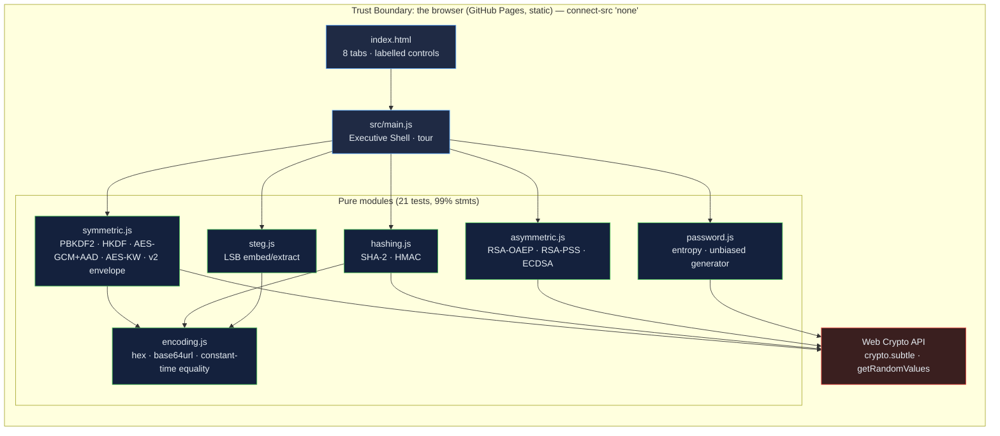

# Encryption Toolkit: applied cryptography in the browser, every primitive tested against a published vector

[](https://github.com/Freddricklogan/encryption-toolkit/actions/workflows/deploy.yml)
[](#5-getting-started--verification)
[](https://github.com/Freddricklogan/encryption-toolkit/actions/workflows/codeql.yml)
[](LICENSE)
[](https://freddricklogan.github.io/encryption-toolkit/)

## 1. Executive Summary & Business Impact

**Problem statement.** Cryptography demos teach by example, and a wrong
example teaches a wrong habit: a password generator with modulo bias, a
key-derivation count from a decade ago, an HMAC compared with `===`, a
"decrypt" button that guessed which box held the ciphertext, and a
steganography feature that returned garbage from an empty image. The
previous version of this page had all of them (`AUDIT.md`).

**Solution & value delivered.** Eight tools on the Web Crypto API, each
backed by a pure module and a test against a published vector: an
AES-256-GCM passphrase envelope with PBKDF2 at 600,000 iterations, AES-KW
key wrapping and associated data (NIST GCM test case 16, RFC 3394, PBKDF2
vectors); HKDF (RFC 5869); RSA-OAEP with the plaintext limit stated; SHA-2
digests (FIPS 180-4) and HMAC with constant-time verification (RFC 4231);
RSA-PSS and ECDSA P-256 signatures with tamper and wrong-key tests; a
password analyser with stated assumptions and an unbiased generator; LSB
steganography with a header so an empty carrier says so. The page's policy
is `connect-src 'none'`: it cannot transmit anything.

**[→ Read the full case study](docs/CASE_STUDY.md)**

| Outcome | How this repo delivers it |
| --- | --- |
| Primitives you can trust | 21 tests pin NIST, FIPS and RFC vectors; a wrong implementation fails CI |
| A real envelope, not a bare ciphertext | Versioned `v2` format: salt, IV, AES-KW-wrapped data key, associated data, ciphertext, iteration count |
| Failures that name themselves | Wrong passphrase fails at key unwrap; modified ciphertext or associated data fails at authentication; malformed input fails at parsing |
| No bias, no theatre | Rejection-sampled generator with a test that forces the rejection path; crack-time rates stated as assumptions |
| Nothing leaves the page | `default-src 'none'; connect-src 'none'`; no third-party script; keys ephemeral |

## 2. Demonstrated Competencies & Technical Skills

- **Cybersecurity & Compliance** — AEAD with associated data, key
  wrapping, KDFs, constant-time comparison, OAEP limits, PSS and ECDSA,
  strict CSP.
- **Systems Architecture & CS** — pure modules over Web Crypto that run
  identically in Node 22 and the browser, so vectors are tested where the
  code runs; a self-describing envelope format.
- **Data Science & AI** — entropy estimation with pattern penalties,
  uniformity testing of the generator with a statistical tolerance.
- **EdTech & Human-Centered Design** — every tool states what it does on
  the page; the tour goes from envelope to tamper to vectors to bias.

## 3. System Architecture & Data Flow



No CDN, no fonts beyond Google Fonts CSS, no network requests possible from script.

## 4. Technical Highlights & Engineering Decisions

### ADR-1 — Wrap a data key instead of encrypting with the passphrase key

**Context.** The old format was `salt.iv.ciphertext` under a
PBKDF2-derived key; changing the passphrase meant re-encrypting
everything, and a wrong passphrase and a corrupted ciphertext produced the
same error.

**Decision.** PBKDF2 derives a key-encryption key; a random 256-bit data
key is wrapped with AES-KW (RFC 3394) and stored in the envelope; the
data key encrypts under AES-GCM with associated data. The iteration count
travels in the envelope.

**Consequence.** Re-keying re-wraps 40 bytes; failures are distinguishable
(unwrap versus authentication); the format can evolve by version.

### ADR-2 — Test vectors, not round trips alone

**Context.** A round trip proves encrypt and decrypt agree with each
other, not with the standard.

**Decision.** Every primitive with a published vector is pinned to it:
GCM test case 16 with AAD, HKDF case 1, AES-KW §4.6, PBKDF2 at 1 and 4096
iterations, FIPS 180-4 "abc", RFC 4231 case 2. Round trips remain for
RSA and signatures, with tamper and wrong-key cases.

**Consequence.** The tests run in Node 22 on the same Web Crypto
implementation family the browser uses; a parameter mistake fails CI.

### ADR-3 — Rejection sampling for the generator

**Context.** `draw % alphabet.length` is biased whenever the alphabet
size does not divide 2³².

**Decision.** Draws at or above the largest multiple of the alphabet size
are discarded; the test injects such draws and asserts the output skips
them, and a 20,000-draw uniformity test bounds the deviation at 8%.

**Consequence.** Every character is equally likely, and the property is
guarded rather than assumed.

## 5. Getting Started & Verification

**Prerequisites.** Node 22 LTS (Web Crypto is global). No build step; the
page is served from the repository root.

```bash
git clone https://github.com/Freddricklogan/encryption-toolkit.git
cd encryption-toolkit
npm ci
npm run lint && npm run validate && npm run coverage
npx serve .    # open http://localhost:3000
```

**Verification — the numbers this repository actually produced:**

```bash
npm run coverage   # 21 passed / 21; All files 99.34% stmts, 93.58% branches
npm run lint       # 0 problems
npm run validate   # html-validate index.html: clean
```

| Check | Result |
| --- | --- |
| Unit tests (Vitest, Node Web Crypto) | **21 passed / 21** across 6 files |
| Published vectors | NIST GCM TC16 · RFC 5869 TC1 · RFC 3394 §4.6 · PBKDF2-SHA256 (1 / 4096 it.) · FIPS 180-4 "abc" ×3 · RFC 4231 TC2 |
| Coverage (pure modules) | **99.34%** statements, **93.58%** branches (`main.js`, `ui.js` covered by the browser smoke test) |
| ESLint, html-validate | clean |
| Headless Chrome smoke | **0 console errors**; seal in 69 ms at 600,000 iterations → open → wrong passphrase named; SHA-256("abc") ba7816bf…; HMAC 5bdcc146… verified; ECDSA sign/verify then tamper → invalid; "password123" very weak 26.9 bits with three patterns, generated 20-char very strong; steg hide/reveal round trip, empty carrier → no payload; RSA-2048 344-char ciphertext round trip; benchmark SHA-256 964 MiB/s, AES-GCM 1,404 MiB/s on this machine; five tour steps; no horizontal scroll at 1280 or 400 px |

## 6. Live Demo & Production Showcase

**<https://freddricklogan.github.io/encryption-toolkit/>**

**30-second guided walkthrough.** Press **Take the 30-second tour**.

1. **A versioned envelope, not a bare ciphertext** — seal the sample.
2. **Tamper and it fails loudly** — open it, then change a character.
3. **Digests match FIPS 180-4** — SHA-256("abc").
4. **An unbiased generator** — rejection sampling, tested.
5. **Steganography that says what it survives** — hide and reveal.

Benchmarks measure this device through Web Crypto and vary by browser and CPU; they are not a comparison of algorithms.
